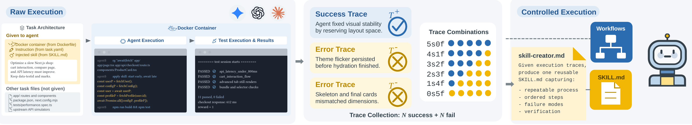
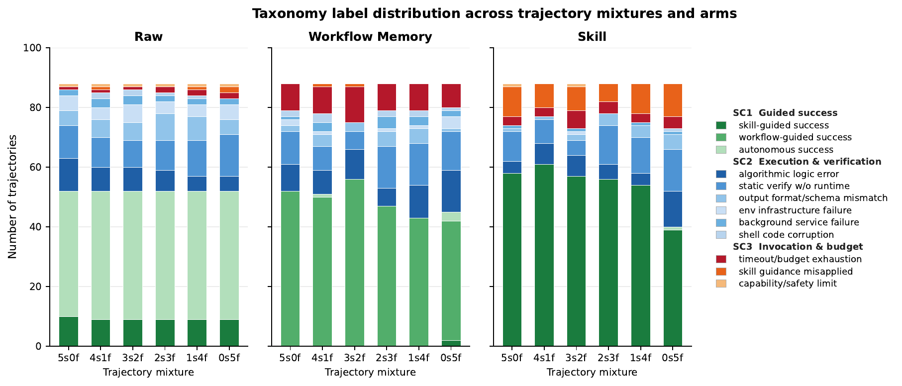
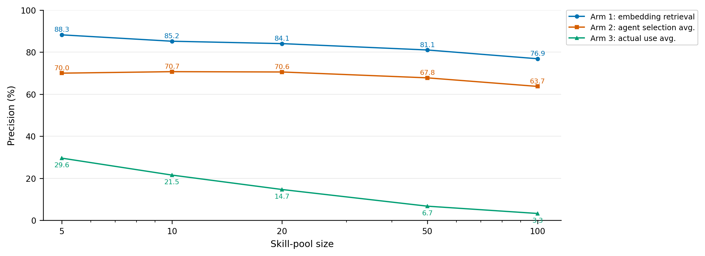
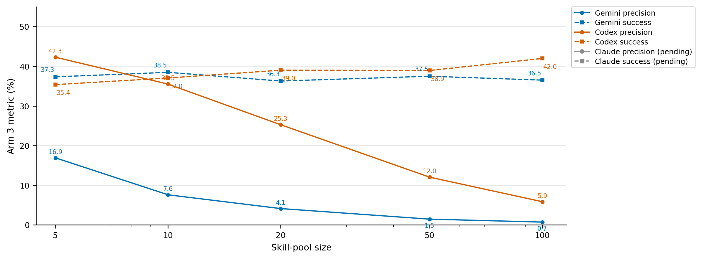
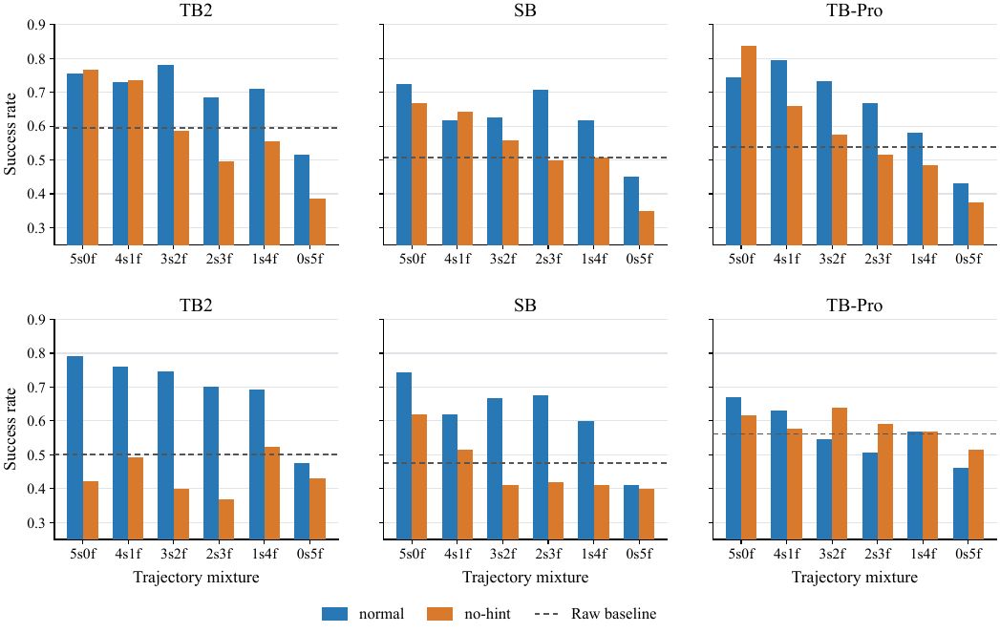
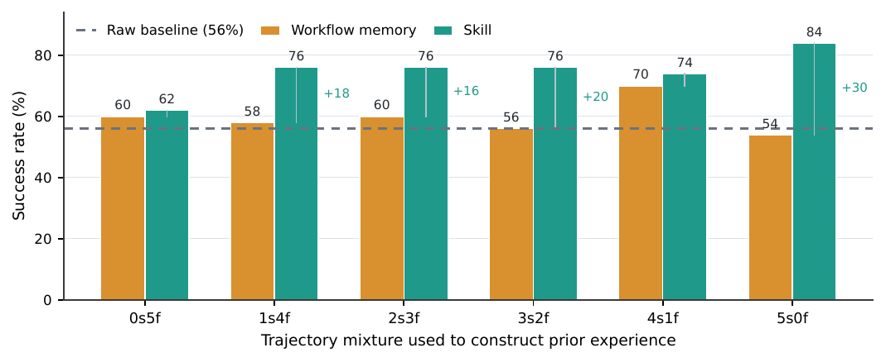

# Demystifying Agent Skills: Why They Work - Until They Don't

Research code and artifacts for the paper [Demystifying Agent Skills: Why They Work - Until They Don't](https://arxiv.org/abs/2608.14036).

**Zhiyuan Jiang** *, **Fangrui Huang** *, **Hanwen Xing**, **Xander Wu**, **Yipeng Gao**, **Rui Cao**, **Mengdi Wang** †, **Shilong Liu** †, **Yijiang Li** †

*Equal contribution · †Corresponding authors

  

## What the study asks

Aggregate success tells us that a skill helped, but not why, when, or whether the agent used the right one. We study skills as structured packages of procedural experience and turn this question into four comparisons:

1. **Representation:** when the task and source experience are fixed, does Skill outperform Workflow Memory?
2. **Outcome annotation:** do gains come from procedural content or from visible success/failure labels?
3. **Framework transfer:** does guidance distilled by one agent framework remain useful in another?
4. **Retrieval and use:** as skill pools grow or become more confusable, can agents identify and use the right skill?

The retrieval arms are independent diagnostics. Embedding ranking, explicit agent selection, and real execution do not form a serial pipeline, and the output of one arm is not passed to another.

## Core findings

- **Representation matters.** With matched source experience and target tasks, Skill reaches **61.9%** success versus **55.9%** for Workflow Memory, a **+6.06 point** difference.
- **Skills act mainly as procedural anchors.** Procedural anchoring accounts for **65.7%** of skill mechanisms, compared with **4.5%** for explicit knowledge injection.
- **Execution becomes more robust, but not universally reliable.** Execution and verification modes account for **23.5%** of Skill labels, compared with **37.3%** for Raw and **33.3%** for Workflow Memory.
- **Invocation creates a new failure boundary.** Misapplied or ignored skill guidance appears in **10.0%** of Skill cases, compared with **0.8%** for Raw and **0.4%** for Workflow Memory.
- **Retrieval quality and actual use diverge.** Average embedding top-1 precision falls from **88.3%** at pool size 5 to **76.9%** at pool size 100, while parsed actual-use precision falls from **29.6%** to **3.3%**. Downstream success remains around **36-39%**.
- **Outcome labels can matter when failed traces enter the pool.** For Gemini on Terminal-Bench 2 at the 3s2f mixture, normal skills reach **74.62%** versus **40.00%** for no-hint skills.
- **Distilled artifacts can transfer across frameworks.** Workflow Memory and Skill artifacts built with Codex are evaluated with Gemini CLI without regenerating the artifacts; see the transfer figure and the paper for the controlled comparison.

## Study overview

The pipeline starts with raw agent trajectories, selects source experiences, builds comparable procedural artifacts, and evaluates them on the same target tasks. The taxonomy and retrieval analyses explain changes that aggregate success alone cannot expose.

## Result figures

The selected figures below are paper result views kept as local repository assets. PDF versions are included alongside the plots when available.

### Taxonomy

The paired trajectory analysis maps behavior into three high-level categories and twelve skill-use modes. The taxonomy explains which execution failures are reduced by procedural guidance and which failures arise from invocation, verification, or task boundaries.

### Retrieval: identification versus use

Offline identification degrades as pools grow, while execution-time actual-use precision drops much more sharply. Downstream success remains comparatively stable, showing that exact ground-truth skill invocation and task completion are related but not equivalent.

  
  

### Outcome annotation and transfer

Outcome annotations can matter when failed traces enter the source pool: at the 3s2f Terminal-Bench 2 mixture, normal skills reach 74.62% versus 40.00% for no-hint skills.

Distilled artifacts can transfer across frameworks when the source experience and artifacts are held fixed.

The mixture-specific plots are available as <code>assets/5s0f.pdf</code> through <code>assets/0s5f.pdf</code>. The remaining PDF figures in <code>assets/</code> provide vector-quality versions for paper use.

## Repository layout

~~~text
assets/                         Paper and website figures
pm2s-clean/                     Reusable end-to-end experiment pipeline
research/skill_retrieval/       ClawHub noise-pool preparation and diagnostics
research/failure-taxonomy/      Taxonomy construction and paired analysis
src/                            Original PM2Skills package
scripts/                        Original server and research entrypoints
skills-testset-eval/            Existing benchmark/testset evaluation code
testsets/                       Existing task manifests and evaluation utilities
docs/                           Project and experiment documentation
~~~

pm2s-clean/ is the recommended starting point for new runs. It excludes trajectories, generated skills, logs, Docker state, API keys, OAuth tokens, and historical outputs. Outputs should be stored outside the repository.

## Reproduction workflow

Run the following stages in order. Use a unique output root for each benchmark, agent, model, provider, and condition.

### 1. Prepare the environment

The clean scripts expect the Harbor runtime, benchmark datasets, and generated outputs to live outside this repository:

~~~bash
cd pm2s-clean

export PROCMEM2SKILLS_ROOT=/path/to/procmem2skills
export TASK_SOURCE_ROOT=/path/to/procmem2skills/benchmarks/harbor-datasets
export SKILLSBENCH_ROOT=/path/to/skillsbench
export PM2S_RESULTS_ROOT=/path/to/results
export PM2S_RETRIEVAL_ROOT=/path/to/skill-retrieval-data
~~~

Check every entrypoint before a long run:

~~~bash
bash scripts/run_raw.sh --help
bash scripts/collect_traces.sh --help
python3 scripts/export_workflows.py --help
python3 scripts/generate_skills.py --help
bash scripts/run_eval.sh --help
~~~

### 2. Configure a provider

Set the credential in the private shell that launches the run. Never put a key, password, OAuth file, or token in the repository, prompt files, manifests, or output metadata.

| Runtime | Required setup |
| --- | --- |
| Gemini CLI / API | Export GOOGLE_API_KEY or GEMINI_API_KEY; use PROVIDER=google and API_KEY_ENV to name the variable. |
| OpenAI-compatible API | Export OPENAI_API_KEY, OPENROUTER_API_KEY, or UNIAPI_API_KEY as appropriate. |
| Codex subscription | Authenticate interactively as the same Unix user that launches Harbor, then smoke-test codex exec before the batch. |
| Claude Code subscription | Use a private CLAUDE_CONFIG_DIR, complete claude auth login --claudeai, and run a headless claude -p smoke test. |

For any provider, a smoke failure is a configuration failure. A 429 can be rate limiting or exhausted quota; distinguish those cases before discarding a batch. The clean scripts record failed settings and continue where possible, but a confirmed quota incident should be isolated under a new run ID.

### 3. Collect raw trajectories

Example for Gemini CLI on Terminal-Bench 2:

~~~bash
DATASET=terminal-bench@2.0 \
AGENT=gemini-cli \
MODEL=google/gemini-3.1-pro-preview \
PROVIDER=google \
API_KEY_ENV=GOOGLE_API_KEY \
N_ATTEMPTS=5 \
N_CONCURRENT=10 \
bash scripts/run_raw.sh
~~~

Useful controls include DATASET_PATH, RESULTS_ROOT, JOBS_DIR, TASK_NAME, EXCLUDE_TASK_NAME, N_TASKS, ENV_TYPE, and PREPULL_IMAGES. The launcher records agent, model, and provider metadata with each run.

### 4. Collect balanced mixed traces

Collection adds trials only for tasks that still need success/failure evidence:

~~~bash
DATASET=terminal-bench@2.0 \
RAW_RESULTS_PATH=/path/to/raw-results \
OUTPUT_PATH=/path/to/mixed-collect \
AGENT=gemini-cli \
MODEL=google/gemini-3.1-pro-preview \
PROVIDER=google \
API_KEY_ENV=GOOGLE_API_KEY \
TRIALS_PER_ROUND=5 \
MAX_ATTEMPT_BLOCKS=10 \
TARGET_SUCCESS=5 \
TARGET_FAILURE=5 \
N_CONCURRENT=10 \
bash scripts/collect_traces.sh
~~~

Set CONTINUE_FROM_EXISTING=1 only when resuming the same setting. Keep raw and collection output roots separate.

### 5. Induce workflows

Select status-qualified traces and export the shared workflow source:

~~~bash
python3 scripts/export_workflows.py \
  --status-log /path/to/mixed-collect/status.log \
  --raw-root /path/to/raw \
  --collect-root /path/to/mixed-collect \
  --workflow-out /path/to/workflows.json \
  --metadata-out /path/to/workflows.meta.json \
  --success-per-task 5 \
  --failure-per-task 5 \
  --enable-cleaning
~~~

The resulting workflow JSON is the common input to normal skills, no-hint skills, and compact procedural baselines.

### 6. Generate normal and no-hint skills

Normal skills expose success/failure status to the skill creator:

~~~bash
python3 scripts/generate_skills.py \
  --workflow-input /path/to/workflows.json \
  --output-root /path/to/skill-outputs \
  --benchmark terminalbench2 \
  --agent gemini-cli \
  --model google/gemini-3.1-pro-preview \
  --provider google \
  --api-key-env GOOGLE_API_KEY \
  --skill-creator-model google/gemini-3.1-pro-preview \
  --system-prompt-file configs/skill_generator_system_prompt.txt \
  --hint-mode with-status \
  --resume
~~~

For no-hint skills, keep the same workflow input and change only the creator prompt and hint mode:

~~~bash
--system-prompt-file configs/skill_generator_system_prompt_no_hint.txt \
--hint-mode no-hint
~~~

Keep normal and no-hint output roots separate. The generator writes SKILL.md plus a generation manifest for every task/condition.

### 7. Evaluate workflow, skill, and compact-procedure injection

The main evaluation entrypoint is scripts/run_eval.sh. It supports workflow, skill, short-plan, test-first, and script arms. Example:

~~~bash
bash scripts/run_eval.sh \
  --trace-root /path/to/traces \
  --skills-root /path/to/skills \
  --output-root /path/to/eval-outputs \
  --benchmark-output terminalbench2 \
  --provider google \
  --api-key-env GOOGLE_API_KEY \
  --base-url https://generativelanguage.googleapis.com/v1beta/openai \
  --agent gemini-cli \
  --model google/gemini-3.1-pro-preview \
  --m-success 5 \
  --n-failure 0 \
  --n-attempts 5 \
  --n-concurrent 10 \
  --arms workflow,skill \
  --run-id workflow-skill-terminalbench2-gemini
~~~

Use --workflow-hint-mode no-hint only for no-hint workflow sources. Enable Docker cleanup unless another supervisor owns the containers. Inspect one result.json and one trajectory before scaling concurrency.

### 8. Run the three retrieval arms

Retrieval is evaluated on SkillsBench with a shared benchmark/agent/model/pool/seed directory layout:

~~~text
<retrieval-root>/<benchmark>/<agent-model>/
  embedding_based/<mode>/k<pool-size>/seed-<seed>/
  agent_pick/<mode>/k<pool-size>/seed-<seed>/
  real_execution/<mode>/k<pool-size>/seed-<seed>/
~~~

Build manifests and candidate pools first:

~~~bash
python3 scripts/retrieval/build_skillsbench_manifests.py \
  --root /path/to/retrieval-data \
  --tasks-root /path/to/skillsbench/tasks \
  --benchmark skillsbench \
  --overwrite

python3 scripts/retrieval/filter_noise_pool.py \
  --root /path/to/retrieval-data \
  --noise-pool /path/to/noise-pool \
  --output /path/to/retrieval-data/manifests/noise.jsonl \
  --english-only

python3 scripts/retrieval/build_candidate_pools.py \
  --root /path/to/retrieval-data \
  --benchmark skillsbench \
  --pool-sizes 5,10,20,50,100 \
  --noise-modes random,similar,dissimilar \
  --seeds 42
~~~

**Arm 1: embedding-based retrieval.** This arm needs no API key when using the local embedding model:

~~~bash
python3 scripts/retrieval/run_embedding_retrieval.py \
  --root /path/to/retrieval-data \
  --candidate-pool /path/to/candidate-pool.json \
  --method local-embedding \
  --local-model-path /path/to/Qwen3-Embedding-0.6B \
  --benchmark skillsbench \
  --agent embedding \
  --model Qwen3-Embedding-0.6B \
  --top-k 1
~~~

Use --top-k 3 or --top-k 5 for set-level precision, recall, and F1. Top-1 intentionally reports recall and F1 as NA.

**Arm 2: let agents pick.** The agent sees the task and candidate skill pool, chooses skills, and does not execute the downstream task. Use scripts/retrieval/run_agent_pick.py with the provider and model settings for the desired agent.

**Arm 3: real execution.** The full candidate pool is available during task execution. The run records the final verifier outcome and parses activated skill names from the trajectory. Use scripts/retrieval/run_real_execution.sh, then summarize with scripts/retrieval/summarize_execution_retrieval.py.

The formal metric definitions and aggregation rules are documented in pm2s-clean/README.md; all three arms report precision, recall, and F1 in the same result schema where the metric is defined.

### 9. Reproduce the taxonomy analysis

The failure-taxonomy pipeline is self-contained under research/failure-taxonomy/:

~~~bash
cd research/failure-taxonomy
python3 01_build_manifest.py
PARALLEL=4 SAMPLE_N=240 python3 02_sample_label.py
python3 03_aggregate_modes.py
BATCH_LIMIT=600 PARALLEL=2 python3 04_pair_compare.py
python3 05_report.py
~~~

The checked-in outputs include the 8,135-trial manifest, 240 open-coded records, 238 valid labels, the 12-mode canonical map, paired labels, and summary tables. Detailed data assumptions and resume behavior are in README.md, PIPELINE.md, and HANDOFF.md in that directory.

## Noise-pool artifact

research/skill_retrieval/ contains the reproducible ClawHub download and quality-check scripts, the full manifest, and the source-branch noise-pool archive pointer. The archive is tracked with Git LFS:

~~~bash
git lfs install
git lfs pull
~~~

Alternatively, download a fresh pool from the public registry with download_noise.py; the script is resume-aware and writes complete SKILL.md files, attachments, and metadata. The quality checker documents language filtering, empty descriptions, and duplicate handling.

## Validation and troubleshooting

Run the clean-pipeline tests when changing the reusable scripts:

~~~bash
python3 -m pytest pm2s-clean/tests
python3 -m compileall pm2s-clean/scripts
~~~

Before a batch, verify:

1. The provider smoke test returns a successful response.
2. The selected Unix user can access Docker and the intended benchmark data.
3. The result path is new and does not overlap raw, collection, or quarantine data.
4. One task writes a non-empty trajectory and a result record with the expected agent and model.
5. Only then increase trial count or concurrency.

Do not treat every transient 429 as exhausted quota. Preserve successful trials, quarantine only confirmed invalid trials, and resume by task using the remaining valid-trial count rather than multiplying the entire batch again.

## Citation

~~~bibtex
@article{jiang2026demystifying,
  title   = {Demystifying Agent Skills: Why They Work - Until They Don't},
  author  = {Jiang, Zhiyuan and Huang, Fangrui and Xing, Hanwen and Wu, Xander and Gao, Yipeng and Cao, Rui and Wang, Mengdi and Liu, Shilong and Li, Yijiang},
  year    = {2026},
  note    = {Preprint},
  url     = {https://arxiv.org/abs/2608.14036}
}
~~~
